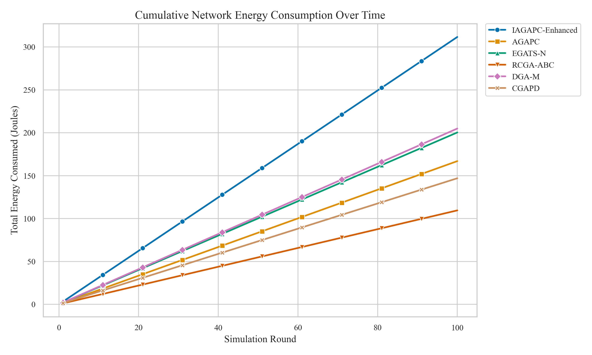
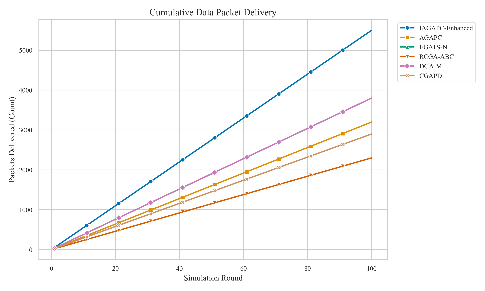
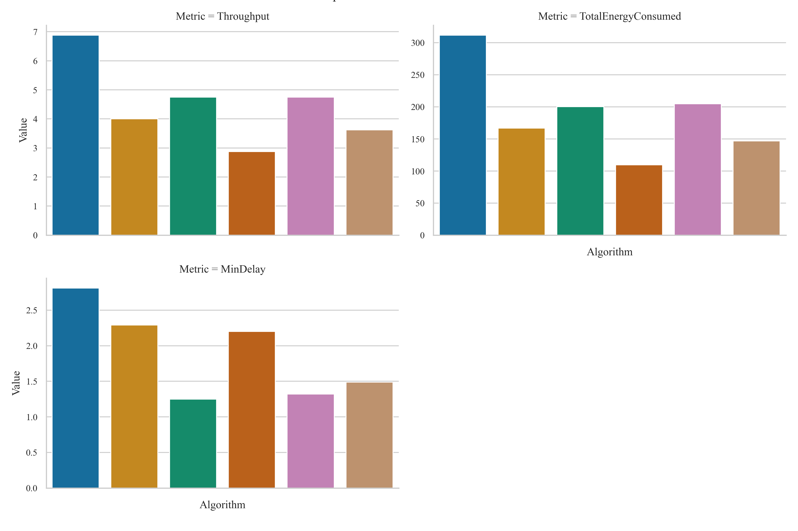

# WSN Routing Optimizer

> NS-3 simulation data pipeline for comparative analysis of **Wireless Sensor Network (WSN)** routing algorithms using genetic-algorithm-based approaches.

---

## Table of Contents

- [Overview](#overview)
- [Algorithms Compared](#algorithms-compared)
- [Project Structure](#project-structure)
- [Pipeline Architecture](#pipeline-architecture)
- [Visualizations](#visualizations)
- [Key Metrics](#key-metrics)
- [Results Summary](#results-summary)
- [Tech Stack](#tech-stack)
- [Getting Started](#getting-started)
- [How It Works](#how-it-works)
- [License](#license)

---

## Overview

Wireless Sensor Networks (WSNs) consist of spatially distributed autonomous sensors that monitor physical or environmental conditions. A critical challenge in WSN design is **energy-efficient routing** — since sensor nodes have limited battery life, optimizing how data is routed through the network directly impacts its operational lifetime.

This project implements a complete simulation-to-visualization pipeline that:

1. **Simulates** six genetic-algorithm-based routing protocols in NS-3 (C++)
2. **Parses** the complex, multi-table simulation logs into structured DataFrames
3. **Cleans** and normalizes the data for analysis
4. **Visualizes** comparative performance metrics using Seaborn and Matplotlib

---

## Algorithms Compared

| Algorithm | Full Name | Key Approach |
|-----------|-----------|-------------|
| **IAGAPC-Enhanced** | Improved Adaptive Genetic Algorithm with Power Control | Multi-objective fitness with adaptive crossover/mutation, Catmull-Rom spline trajectory, cataclysm diversity mechanism |
| **AGAPC** | Adaptive Genetic Algorithm with Power Control | Adaptive crossover and mutation rates based on fitness distribution |
| **EGATS-N** | Energy-efficient GA with Trust-based Selection | Trust-aware node selection combined with energy metrics |
| **RCGA-ABC** | Real-Coded GA with Artificial Bee Colony | Hybrid GA + swarm intelligence for continuous optimization |
| **DGA-M** | Distributed Genetic Algorithm - Modified | Distributed island model with migration between sub-populations |
| **CGAPD** | Cooperative GA with Power Distribution | Cooperative co-evolution with dedicated power allocation |

---

## Project Structure

`
wsn-routing-optimizer/
│
├── IAGAPC.cc                        # NS-3 C++ simulation source
│                                     # Implements the IAGAPC-Enhanced algorithm
│                                     # with Catmull-Rom spline trajectory
│                                     # optimization and multi-objective fitness
│
├── wsn.py                           # Python data pipeline
│                                     # Handles ingestion, parsing, cleaning,
│                                     # and visualization of simulation results
│
├── wsn-optimizer-results.csv        # Raw NS-3 simulation output (639 lines)
│                                     # Contains round-by-round data for all
│                                     # six algorithms + summary table
│
├── Fig1_Energy_Consumption.png      # Cumulative energy consumption plot
├── Fig2_Packet_Delivery.png         # Cumulative packet delivery plot
├── Fig3_Summary_Metrics.png         # Summary comparison across algorithms
│
└── README.md                        # This file
`

---

## Pipeline Architecture

The Python pipeline (wsn.py) is organized into four modular stages:

`
┌─────────────────┐    ┌─────────────────┐    ┌─────────────────┐    ┌─────────────────┐
│   SECTION 1      │    │   SECTION 2      │    │   SECTION 3      │    │   SECTION 4      │
│                 │    │                 │    │                 │    │                 │
│  Data Ingestion │───>│  Data Cleaning  │───>│ Visualization   │    │   Execution     │
│  & Parsing      │    │ & Normalization │    │  (Seaborn)      │    │  Orchestrator   │
│                 │    │                 │    │                 │    │                 │
└─────────────────┘    └─────────────────┘    └─────────────────┘    └─────────────────┘
`

### Stage 1: Data Ingestion & Parsing

- Reads the raw NS-3 multi-table CSV log (wsn-optimizer-results.csv)
- Uses **regex-based context detection** to distinguish between algorithm sections, round data tables, and the global summary table
- Employs a **state machine** (capture_mode) to handle different parsing contexts
- Outputs two DataFrames: 
ound_data (per-round metrics) and summary_data (final comparison)

### Stage 2: Data Cleaning & Normalization

- Coerces all numeric columns to appropriate dtypes (int32, loat64)
- Handles parsing errors gracefully with pd.to_numeric(errors='coerce')
- Drops incomplete records with dropna()

### Stage 3: Visualization

- Generates comparative line plots using **Seaborn** with the colorblind palette
- Distinct markers per algorithm for accessibility
- Plots show **round-by-round evolution** for energy and throughput metrics

### Stage 4: Execution

- Orchestrates the full pipeline from file ingestion to display
- Prints the summary performance table to console

---

## Visualizations

### 1. Cumulative Network Energy Consumption

Tracks total energy consumed across all nodes per simulation round. Lower energy consumption indicates a more efficient routing strategy.

### 2. Cumulative Data Packet Delivery

Measures the total number of data packets successfully delivered to the base station. Higher values indicate better reliability and throughput.

### 3. Summary Comparison

Aggregated performance metrics across all algorithms in a single view.

---

## Key Metrics

| Metric | Description | Unit |
|--------|-------------|------|
| MaxResidualEnergy | Maximum remaining energy across all nodes | Joules |
| TotalEnergyConsumed | Cumulative energy used by the entire network | Joules |
| PacketsDelivered | Total data packets successfully routed to sink | Count |
| PacketLoss | Number of packets lost during transmission | Count |
| Throughput | Data delivery rate per round | Packets/Round |
| AvgHops | Average number of hops per packet delivery | Hops |
| MinDelay | Minimum end-to-end delay for packet delivery | Seconds |
| NetworkLifetime | Total operational time until first node death | Rounds |
| EnergyEfficiency | Ratio of useful work to energy consumed | Packets/Joule |
| ProcessingTime(ms) | Computational time for the algorithm execution | Milliseconds |

---

## Results Summary

Performance summary across 100 simulation rounds:

| Algorithm | Packets Delivered | Energy Consumed (J) | Efficiency (Pkt/J) | Throughput | Processing (ms) |
|-----------|:-:|:-:|:-:|:-:|:-:|
| **IAGAPC-Enhanced** | **5500** | 311.70 | 17.65 | **6.88** | 1411 |
| EGATS-N | 3800 | 200.37 | 18.96 | 4.75 | 573 |
| DGA-M | 3800 | 204.95 | 18.54 | 4.75 | 2296 |
| AGAPC | 3200 | 166.96 | 19.17 | 4.00 | 553 |
| CGAPD | 2900 | 146.97 | 19.73 | 3.62 | 540 |
| RCGA-ABC | 2300 | 109.52 | **21.00** | 2.88 | **500** |

**Key Findings:**
- **IAGAPC-Enhanced** achieves the highest throughput and most packets delivered
- **RCGA-ABC** is the most energy-efficient (21.00 packets/joule) and fastest to compute
- **DGA-M** has the highest computational overhead (2296ms) due to its distributed island model

---

## Tech Stack

| Component | Technology |
|-----------|-----------|
| **Network Simulation** | NS-3 (C++) |
| **Data Processing** | Python 3, Pandas |
| **Visualization** | Seaborn, Matplotlib |
| **Parsing** | Regex, IO Streams |

---

## Getting Started

### Prerequisites

`ash
pip install pandas matplotlib seaborn
`

### Run the Analysis Pipeline

`ash
python wsn.py
`

This will:
1. Parse wsn-optimizer-results.csv
2. Clean and normalize the data
3. Display interactive comparison plots
4. Print the summary performance table

### Run the NS-3 Simulation (Optional)

To regenerate simulation data, you need [NS-3](https://www.nsnam.org/) installed:

`ash
# Copy IAGAPC.cc to your NS-3 scratch directory
cp IAGAPC.cc ~/ns-3-dev/scratch/

# Run the simulation
cd ~/ns-3-dev
./ns3 run scratch/IAGAPC
`

---

## How It Works

### The IAGAPC-Enhanced Algorithm

The core NS-3 simulation (IAGAPC.cc) implements an **Improved Adaptive Genetic Algorithm with Power Control** for mobile sink trajectory optimization:

1. **Chromosome Representation**: Each solution encodes a sequence of Rendezvous Points (RPs) and dwell times
2. **Catmull-Rom Spline Interpolation**: Converts discrete RPs into smooth, kinematically feasible trajectories
3. **Multi-Objective Fitness**: Weighted combination of:
   - Residual energy balance (40%)
   - Path smoothness (30%)
   - Node coverage / PDR (20%)
   - Path delay (10%)
4. **Adaptive Genetic Operators**: Crossover and mutation rates adjust dynamically based on population fitness and diversity
5. **Cataclysm Mechanism**: When population diversity drops below a threshold, 95% of the population is regenerated while preserving elite solutions

---

## License

MIT
